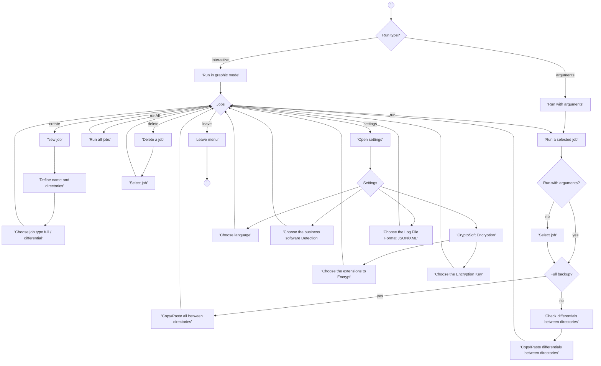
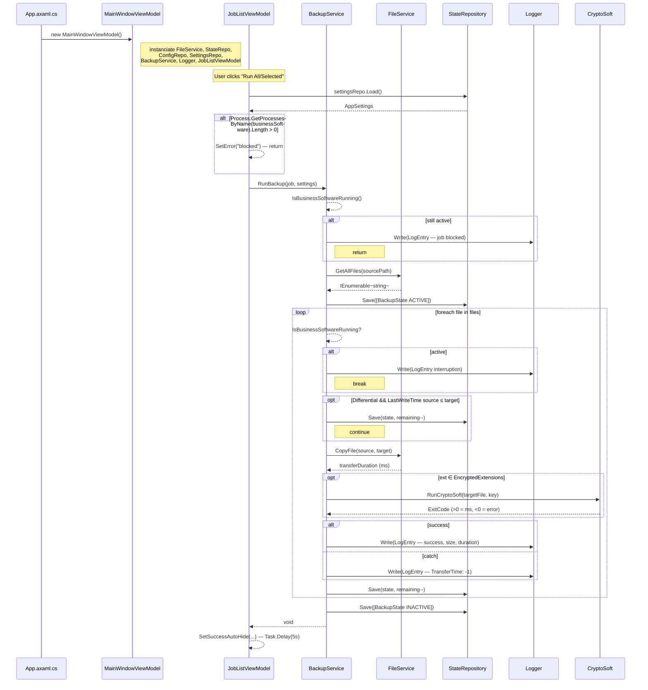

# EasySave 2.0

A graphical backup tool built with **Avalonia UI** and **.NET 10**, following an **MVVM architecture**.  
EasySave 2.0 lets users define unlimited backup jobs, encrypt files via CryptoSoft, detect running business software before launching a backup, and log every transfer to a daily JSON or XML file.

> **Version history**  
> `1.0` — Console, 5 jobs max, JSON logs  
> `1.1` — Console, 5 jobs max, JSON **or XML** logs (user choice)  
> `2.0` — **Graphical UI (Avalonia)**, unlimited jobs, CryptoSoft encryption, business software detection

---

## Table of contents

1. [Features](#features)
2. [Architecture overview](#architecture-overview)
3. [Project structure](#project-structure)
4. [Diagrams](#diagrams)
5. [Getting started](#getting-started)
6. [Usage](#usage)
7. [Output files](#output-files)
8. [Configuration reference](#configuration-reference)

---

## Features

- **Graphical interface** built with Avalonia — runs on Windows, Linux, and macOS.
- **Unlimited backup jobs** — create, run, and delete as many jobs as needed.
- **Full backup** — copies every file from source to target, overwriting existing files.
- **Differential backup** — copies only files that are missing or modified since the last backup.
- **CryptoSoft encryption** — files matching user-defined extensions are encrypted via XOR after each copy. Encryption time is recorded in the log.
- **Business software detection** — if a defined process is running, backup jobs are blocked. In sequential mode, the current file transfer completes before stopping.
- **Real-time state file** (`state.json`) — updated after every file transfer, including progression percentage.
- **Daily log file** (`logs/YYYY-MM-DD.json` or `.xml`) — records every transfer with size, duration, and encryption time.
- **Bilingual UI** — French and English, switchable at any time from Settings without restarting.
- **Log format choice** — JSON or XML, switchable from Settings.
- **CLI batch mode** — run jobs non-interactively by passing a job ID / range / list as a command-line argument (identical to v1.0).

---

## Architecture overview

The solution follows a strict **layered MVVM architecture**:

```
┌──────────────────────────────────────────────┐
│              EasySave.UI                     │  Avalonia graphical interface
│   ViewModels: MainWindow, JobList, Settings  │  (MVVM — View + ViewModel)
│   Views: MainWindow, JobListView, Settings   │
│   TranslationService (centralized i18n)      │
└───────────────────┬──────────────────────────┘
                    │ uses interfaces
┌───────────────────▼──────────────────────────┐
│           EasySave.Services                  │  Business logic
│   BackupService + Interfaces/                │  IBackupService, IConfigRepository,
│                                              │  IFileService, IStateRepository,
│                                              │  ISettingsRepository
└───────────────────┬──────────────────────────┘
                    │ uses interfaces
┌───────────────────▼──────────────────────────┐
│        EasySave.Infrastructure               │  File I/O and JSON/XML persistence
│   FileService, ConfigRepository,             │
│   StateRepository, SettingsRepository,       │
│   JsonService                                │
└───────────────────┬──────────────────────────┘
                    │ uses
┌───────────────────▼──────────────────────────┐
│           EasySave.Core                      │  Domain models — no dependencies
│   BackupJob, BackupState, BackupType,        │
│   AppSettings                                │
└──────────────────────────────────────────────┘
              +
┌──────────────────────────────────────────────┐
│               EasyLog                        │  Standalone logging DLL
│   Logger (JSON/XML), LogEntry                │
└──────────────────────────────────────────────┘
              +
┌──────────────────────────────────────────────┐
│            EasySave.ConsoleApp               │  Console interface (v1.1 — kept in parallel)
└──────────────────────────────────────────────┘
```

Each layer depends only on the layer below it. Infrastructure classes are hidden behind interfaces defined in the Services layer, making business logic independently testable and the UI swappable.

---

## Project structure

```
EasySave/
│
├── EasyLog/                                # Standalone logging DLL
│   ├── LogEntry.cs                         # Log record model (includes EncryptionTime)
│   └── Logger.cs                           # Writes daily JSON or XML log files
│
├── EasySave.Core/                          # Domain models (no dependencies)
│   ├── AppSettings.cs                      # User settings (language, business software, encryption, log format)
│   ├── BackupJob.cs                        # Job definition (id, name, paths, type)
│   ├── BackupState.cs                      # Live progress snapshot (includes Progression %)
│   └── BackupType.cs                       # Enum: Full | Differential
│
├── EasySave.Services/                      # Business logic
│   ├── BackupService.cs                    # Executes backup, calls CryptoSoft, detects business software
│   └── Interfaces/
│       ├── IBackupService.cs
│       ├── IConfigRepository.cs
│       ├── IFileService.cs
│       ├── ISettingsRepository.cs
│       └── IStateRepository.cs
│
├── EasySave.Infrastructure/                # Persistence and file system
│   ├── ConfigRepository.cs                 # Reads/writes config.json
│   ├── FileService.cs                      # Wraps Directory/File operations
│   ├── JsonService.cs                      # Generic JSON read/write utility
│   ├── SettingsRepository.cs               # Reads/writes settings.json
│   └── StateRepository.cs                  # Writes state.json after each file
│
├── EasySave.UI/                            # Avalonia graphical interface (v2.0)
│   ├── App.axaml / App.axaml.cs            # Application entry point
│   ├── Program.cs                          # Avalonia bootstrap + CLI argument support
│   ├── TranslationService.cs               # Centralized EN/FR string dictionary
│   ├── ViewLocator.cs                      # Maps ViewModels to Views automatically
│   ├── Tools/
│   │   └── CryptoSoft.exe                  # External encryption executable
│   ├── ViewModels/
│   │   ├── ViewModelBase.cs
│   │   ├── MainWindowViewModel.cs          # Navigation + language/settings propagation
│   │   ├── JobListViewModel.cs             # Job CRUD, run, folder picker, translations
│   │   └── SettingsViewModel.cs            # Settings form, validation, events
│   └── Views/
│       ├── MainWindow.axaml                # Shell with navigation bar
│       ├── JobListView.axaml               # Job list + creation form
│       └── SettingsView.axaml              # Settings panel
│
└── EasySave.ConsoleApp/                    # Console interface (v1.0 / v1.1 — kept in parallel)
    ├── Program.cs
    ├── TranslationService.cs
    ├── ViewModels/
    │   └── JobViewModel.cs
    └── Views/
        └── JobView.cs
```

---

## Diagrams

### Activity diagram



---

### Class diagram

```mermaid
classDiagram
    namespace EasyLog {
        class LogEntry {
            +DateTime Timestamp
            +string BackupName
            +string SourcePath
            +string TargetPath
            +long FileSize
            +long TransferTime
            +long EncryptionTime
        }
        class Logger {
            -readonly string _logDirectory
            -readonly string _format
            +void Logger(string format)
            +void Write(LogEntry entry)
            -void WriteJson(LogEntry entry)
            -void WriteXml(LogEntry entry)
        }
    }
    namespace EasySave.Core {
        class BackupJob {
            +int Id
            +string Name
            +string SourcePath
            +string TargetPath
            +BackupType Type
        }
        class BackupState {
            +string Name
            +DateTime LastActionTime
            +string Status
            +int TotalFiles
            +int RemainingFiles
            +long TotalSize
            +long RemainingSize
            +string CurrentSourceFile
            +string CurrentTargetFile
            +double Progression
        }
        class BackupType {
            <<enumeration>>
            Full
            Differential
        }
        class AppSettings {
            +string BusinessSoftware
            +List~string~ EncryptedExtensions
            +string EncryptionKey
            +string LogFormat
            +string Language
        }
    }
    namespace EasySave.Services {
        class IBackupService {
            <<interface>>
            +void RunBackup(BackupJob job)
        }
        class IConfigRepository {
            <<interface>>
            +List~BackupJob~ Load()
            +void Save(List~BackupJob~ jobs)
        }
        class IFileService {
            <<interface>>
            +IEnumerable~string~ GetAllFiles(string directory)
            +void CopyFile(string source, string target)
        }
        class IStateRepository {
            <<interface>>
            +void Save(List~BackupState~ states)
        }
        class ISettingsRepository {
            <<interface>>
            +AppSettings Load()
            +void Save(AppSettings settings)
        }
        class BackupService {
            -IFileService _fileService
            -Logger _logger
            -IStateRepository _stateRepo
            +void RunBackup(BackupJob job, AppSettings settings)
            -string ToUNC(string path)
            -static long RunCryptoSoft(string filePath, string key)
            -static bool IsBusinessSoftwareRunning(string processName)
        }
    }
    namespace EasySave.Infrastructure {
        class FileService {
            +IEnumerable~string~ GetAllFiles(string directory)
            +void CopyFile(string source, string target)
        }
        class JsonService {
            +void Write~T~(string path, object data)
            +T Read~T~(string path)
        }
        class StateRepository {
            -JsonService _jsonService
            -const string StatePath
            +void Save(List~BackupState~ states)
        }
        class ConfigRepository {
            -const string ConfigPath
            +List~BackupJob~ Load()
            +void Save(List~BackupJob~ jobs)
        }
        class SettingsRepository {
            -const string SettingsPath
            +AppSettings Load()
            +void Save(AppSettings settings)
        }
    }

    Logger ..> LogEntry
    BackupJob --> BackupType
    BackupService ..|> IBackupService
    BackupService --> IFileService
    BackupService --> IStateRepository
    BackupService --> Logger
    FileService ..|> IFileService
    StateRepository ..|> IStateRepository
    ConfigRepository ..|> IConfigRepository
    SettingsRepository ..|> ISettingsRepository
    StateRepository --> JsonService
    ConfigRepository --> JsonService
```



---

### Sequence diagram



---

## Getting started

### Prerequisites

| Requirement | Version |
|---|---|
| .NET SDK | 10.0 or later |
| Avalonia | 12.0.2 (restored automatically) |
| OS | Windows / Linux / macOS |

### Build

```bash
dotnet build
```

### Run the graphical interface (v2.0)

```bash
cd EasySave.UI
dotnet run
```

### Run the console interface (v1.1)

```bash
cd EasySave.ConsoleApp
dotnet run
```

---

## Usage

### Graphical interface

Launch `EasySave.UI` to open the graphical interface. The navigation bar at the top gives access to two sections:

**📋 Jobs** — manage and run backup jobs.  
**⚙ Settings** — configure language, business software detection, CryptoSoft encryption, and log format.

#### Creating a job

Click **＋ New Job** and fill in the form:

| Field | Description | Example |
|---|---|---|
| Name | Unique job name | `Documents backup` |
| Source | Source folder (Browse button available) | `C:\Users\Alice\Documents` |
| Target | Target folder (Browse button available) | `D:\Backups\Documents` |
| Differential | Check to enable differential mode | ☐ (unchecked = Full) |

Click **Save** to confirm. The job appears immediately in the list.

#### Running a job

Select a job in the list and click **▶ Run Selected**, or click **▶▶ Run All** to run every job sequentially. A status message appears for 5 seconds after completion.

If a business software is running (configured in Settings), the job is blocked and an error message is displayed.

#### Deleting a job

Select a job and click **🗑 Delete**.

#### Settings

| Setting | Description |
|---|---|
| Language | English (EN) or Français (FR) — applied immediately on save |
| Business Software | Process name to detect (e.g. `Calculator`). Blocks backups if running. |
| Encrypted extensions | Space-separated list of extensions to encrypt (e.g. `.txt .docx .pdf`) |
| Encryption Key | XOR key passed to CryptoSoft |
| Log File Format | JSON or XML |

### CLI batch mode

Pass a job selector as a command-line argument to run jobs without opening the interface:

```bash
# Run a single job
dotnet run -- 2

# Run a range of jobs
dotnet run -- 1-3

# Run a specific list
dotnet run -- 1;4;5
```

---

## Output files

All output files are written in the application's working directory.

### `settings.json` — application settings

```json
{
  "BusinessSoftware": "Calculator",
  "EncryptedExtensions": [".txt", ".docx"],
  "EncryptionKey": "defaultkey",
  "LogFormat": "JSON",
  "Language": "EN"
}
```

### `config.json` — job definitions

```json
[
  {
    "Id": 1,
    "Name": "Documents backup",
    "SourcePath": "C:\\Users\\Alice\\Documents",
    "TargetPath": "D:\\Backups\\Documents",
    "Type": 0
  }
]
```

Type values: `0` = Full, `1` = Differential.

### `state.json` — live backup progress

```json
[
  {
    "Name": "Documents backup",
    "LastActionTime": "2026-04-30T10:32:10",
    "Status": "ACTIVE",
    "TotalFiles": 120,
    "RemainingFiles": 47,
    "TotalSize": 524288000,
    "RemainingSize": 196608000,
    "Progression": 60.8,
    "CurrentSourceFile": "\\\\DESKTOP\\C$\\Users\\Alice\\Documents\\report.docx",
    "CurrentTargetFile": "\\\\DESKTOP\\D$\\Backups\\Documents\\report.docx"
  }
]
```

Status values: `"ACTIVE"` while running, `"INACTIVE"` when finished.  
Paths are stored in **UNC format** (`\\machine\drive$\...`).

### `logs/YYYY-MM-DD.json` — daily transfer log

```json
[
  {
    "Timestamp": "2026-04-30T10:32:10",
    "BackupName": "Documents backup",
    "SourcePath": "\\\\DESKTOP\\C$\\Users\\Alice\\Documents\\report.docx",
    "TargetPath": "\\\\DESKTOP\\D$\\Backups\\Documents\\report.docx",
    "FileSize": 204800,
    "TransferTime": 37,
    "EncryptionTime": 12
  }
]
```

| Field | Description |
|---|---|
| `FileSize` | Source file size in bytes. `0` = failed copy. |
| `TransferTime` | Copy duration in ms. `-1` = failed copy. |
| `EncryptionTime` | `0` = not encrypted, `>0` = duration in ms, `<0` = CryptoSoft error. |
| `TargetPath` | Empty string `""` when the copy failed. |

XML format follows the same structure when selected in Settings.

---

## Configuration reference

| File | Location | Purpose |
|---|---|---|
| `settings.json` | Working directory | Language, business software, encryption, log format |
| `config.json` | Working directory | Backup job definitions |
| `state.json` | Working directory | Live progress of the most recent run |
| `logs/YYYY-MM-DD.json` or `.xml` | `logs/` sub-directory | Immutable daily audit log |

All files are created automatically on first use — no manual setup required.
