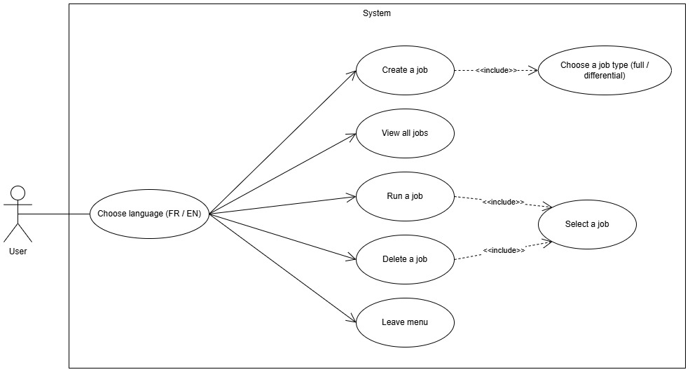
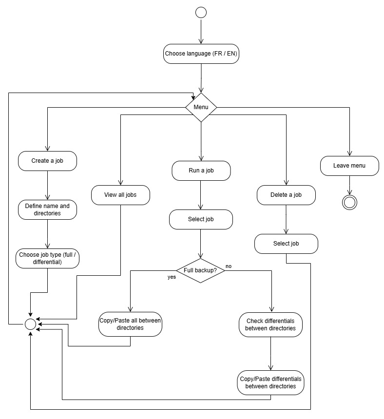
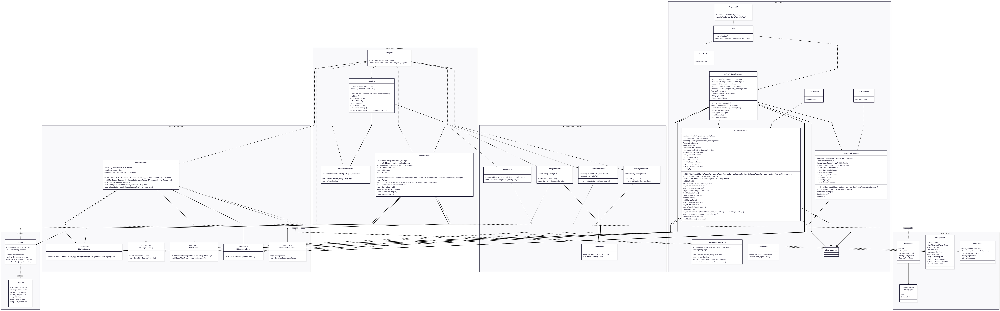
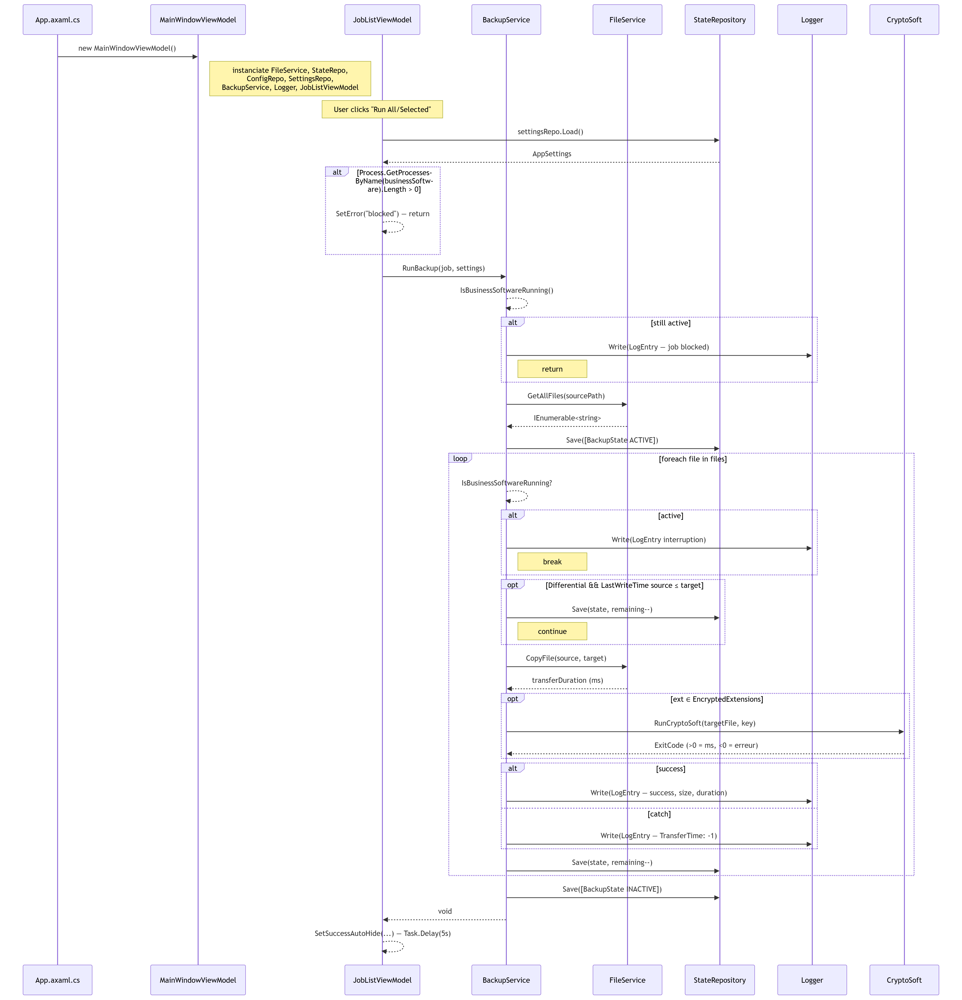

# EasySave

A lightweight console backup tool written in C# / .NET 10.  
EasySave lets users define up to 5 backup jobs, each copying files from a source directory to a target directory using either a Full or Differential strategy. Every run is logged to a daily JSON file and its live progress is written to a state file that external monitors can poll.

## Table of contents

1. [Features](#features)
2. [Architecture overview](#architecture-overview)
3. [Project structure](#project-structure)
4. [Getting started](#getting-started)
5. [Usage](#usage)
6. [Output files](#output-files)
7. [Configuration reference](#configuration-reference)

## Features

- Create, list, run, and delete backup jobs via an interactive console menu.
- **Full backup**: copies every file from source to target, overwriting existing files.
- **Differential backup**: copies only files that are missing at the target or have been modified since the last backup.
- **Real-time state file** (`state.json`): updated after every file transfer so progress and current program state can be monitored externally in realtime.
- **Daily log file** (`logs/YYYY-MM-DD.json`): recording every file transfer attempt with its size, duration, and outcome.
- **Bilingual UI**: French or English, selected at startup.
- **CLI batch mode**: runs jobs non-interactively by passing a job ID / range / list as a command-line argument.

## Architecture overview

The solution follows a layered architecture with strict separation of concerns:

```
┌─────────────────────────────────────────┐
│         EasySave.ConsoleApp             │  Entry point, UI (View + ViewModel)
└────────────────┬────────────────────────┘
                 │ uses
┌────────────────▼────────────────────────┐
│          EasySave.Services              │  Business logic (BackupService)
│     EasySave.Services / Interfaces      │  Contracts (IBackupService, etc.)
└────────────────┬────────────────────────┘
                 │ uses
┌────────────────▼────────────────────────┐
│       EasySave.Infrastructure           │  File I/O, JSON persistence
└────────────────┬────────────────────────┘
                 │ uses
┌────────────────▼────────────────────────┐
│           EasySave.Core                 │  Domain models (BackupJob, BackupState, BackupType)
└─────────────────────────────────────────┘
                 +
┌─────────────────────────────────────────┐
│              EasyLog                    │  Standalone logging library
└─────────────────────────────────────────┘
:wq
```

Each layer depends only on the layer below it. Infrastructure classes are hidden behind interfaces (IFileService, IConfigRepository, IStateRepository) defined in the Services layer, making the core logic independently testable.

### Diagrams
The use case diagram shows the different functionalities of a system from the user’s perspective and how actors interact with it.


The activity diagram represents the flow of actions and decisions within a process from start to finish.


The class diagram describes the structure of a system by showing its classes, attributes, methods, and relationships.


The sequence diagram illustrates how objects interact over time by showing the order of exchanged messages.


## Project structure

```
EasySave/
│
├── EasyLog/                            # Logging library
│   ├── LogEntry.cs                     # Data model for one log record
│   └── Logger.cs                       # Appends entries to daily JSON log files
│
├── EasySave.Core/                      # Domain models (no dependencies)
│   ├── BackupJob.cs                    # Backup job configuration (id, paths, type)
│   ├── BackupState.cs                  # Live progress snapshot of a running job
│   └── BackupType.cs                   # Enum: Full | Differential
│
├── EasySave.Services/                  # Business logic
│   ├── BackupService.cs                # Executes a backup job end-to-end
│   └── Interfaces/
│       ├── IBackupService.cs
│       ├── IConfigRepository.cs
│       ├── IFileService.cs
│       └── IStateRepository.cs
│
├── EasySave.Infrastructure/            # File-system and JSON persistence
│   ├── ConfigRepository.cs             # Reads/writes config.json
│   ├── StateRepository.cs              # Writes state.json after each file
│   ├── FileService.cs                  # Wraps Directory / File operations
│   └── JsonService.cs                  # Generic JSON read/write utility
│
└── EasySave.ConsoleApp/                # Entry point and UI
    ├── Program.cs                      # Composition root + CLI argument parsing
    ├── TranslationService.cs           # FR / EN string lookup
    ├── ViewModels/
    │   └── JobViewModel.cs             # App state + commands (Create, Run, Delete)
    └── Views/
        └── JobView.cs                  # Console menus, prompts, and output
```

## Getting started

### Prerequisites

| Requirement | Version |
|---|---|
| .NET SDK | 10.0 or later |

### Build

```bash
dotnet build
```

### Run

```bash
cd EasySave.ConsoleApp
dotnet run
```

You will be asked to choose a language (FR / EN) and then the main menu appears.

## Usage

### Interactive mode

Launch the application without arguments and select language to use the menu:

```
FR / EN (Default) ?  EN

=== MENU ===
1. Create a job
2. View jobs
3. Run a job
4. Delete a job
5. Quit
Your choice:
```

#### Creating and deleting a job

Choose option 1 and fill:

| Field | Example                          |
|-------------|----------------------------------|
| Job name    | Documents backup                |
| Source path | `C:\Users\Alice\Documents`       |
| Target path | `D:\Backups\Documents`           |
| Type        | 1 (Full) or 2 (Differential) |

Up to 5 jobs can exist at the same time. Job names must be unique (case sensitive).  

> Note: Example directories are marked in Windows format but the program can run on Linux.

#### Running a job

Choose option 3. After the job list is displayed, enter one of the following:

| Format | Meaning |
|---|---|
| 3 | Run job with ID 3 |
| 1-3 | Run jobs 1, 2, and 3 (inclusive range) |
| 1;3;5 | Run jobs 1, 3, and 5 (explicit list) |

#### Deleting a job

Choose option 4 and select the id of the job to delete.

### CLI batch mode

Pass a job selector as a command-line argument to run jobs non-interactively and exit immediately. Useful for scheduled tasks.

```bash
# Run a single job
dotnet run -- 2

# Run a range of jobs
dotnet run -- 1-3

# Run a specific list of jobs
dotnet run -- 1;4;5
```

> Note: In batch mode the language selection prompt is skipped and no interactive menu is shown.

## Output files

All output files are written in the application's working directory (the folder from which the executable is run).

### `config.json` : job configuration

Persisted automatically whenever a job is created or deleted.

```json
[
  {
    "Id": 1,
    "Name": "Documents backup",
    "SourcePath": "C:\\Users\\Alice\\Documents",
    "TargetPath": "D:\\Backups\\Documents",
    "Type": 0
  }
]
```

Type values: 0 = Full, 1 = Differential.


### `state.json` : live backup progress

Overwritten after every file transfer during a run. Poll this file to monitor progress externally.

```json
[
  {
    "Name": "Documents backup",
    "LastActionTime": "2024-04-22T14:32:10",
    "Status": "ACTIVE",
    "TotalFiles": 120,
    "RemainingFiles": 47,
    "TotalSize": 524288000,
    "RemainingSize": 196608000,
    "CurrentSourceFile": "C:\\Users\\Alice\\Documents\\report.docx",
    "CurrentTargetFile": "D:\\Backups\\Documents\\report.docx"
  }
]
```

Status values: "ACTIVE" while running, "DONE" when finished.

### `logs/YYYY-MM-DD.(json|xml)` : daily transfer log

One file per calendar day. Each element records the outcome of a single file copy attempt.

```json
[
  {
    "Timestamp": "2024-04-22T14:32:10",
    "BackupName": "Documents backup",
    "SourcePath": "C:\\Users\\Alice\\Documents\\report.docx",
    "TargetPath": "D:\\Backups\\Documents\\report.docx",
    "FileSize": 204800,
    "TransferTime": 37
  },
  {
    "Timestamp": "2024-04-22T14:32:11",
    "BackupName": "Documents backup",
    "SourcePath": "C:\\Users\\Alice\\Documents\\corrupted.dat",
    "TargetPath": "",
    "FileSize": 0,
    "TransferTime": -1
  }
]
```
```xml
<LogEntry>
    <Timestamp>2026-04-29T10:11:00.4262675+02:00</Timestamp>
    <BackupName>tet</BackupName>
    <SourcePath>/home/klimouun/CESI/A3/177013/Job</SourcePath>
    <TargetPath>/home/klimouun/CESI/A3/727WYSI/Job</TargetPath>
    <FileSize>1706</FileSize>
    <TransferTime>0</TransferTime>
  </LogEntry>
  <LogEntry>
    <Timestamp>2026-04-29T10:11:00.7053077+02:00</Timestamp>
    <BackupName>tet</BackupName>
    <SourcePath>/home/klimouun/CESI/A3/177013/Telegraphic_style.pdf</SourcePath>
    <TargetPath>/home/klimouun/CESI/A3/727WYSI/Telegraphic_style.pdf</TargetPath>
    <FileSize>457172</FileSize>
    <TransferTime>22</TransferTime>
  </LogEntry>
```


| Field        | Description |
|--------------|---|
| FileSize     | Source file size in bytes. 0 indicates a failed copy. |
| TransferTime | Copy duration in milliseconds. -1 indicates a failed copy. |
| TargetPath | Empty string "" when the copy failed. |

## Configuration reference

| File | Location | Purpose |
|---|---|---
| `config.json` | Working directory | Stores all backup job definitions |
| `state.json` | Working directory | Live progress of the most recent run |

### Logging format

The logging system supports two output formats:

| Format | Description |
|--------|-------------|
| JSON (default) | Human-readable, easy to parse |
| XML | Structured format suitable for legacy tools |

The format is defined when initializing the logger.

> Note: Each log write rewrites the entire daily file instead of appending.  
> It's better to rewrite everything instead of appending because of file format constraints, because xml tags or json serialization would cause eventual issues.
> This design ensures valid JSON/XML structure at all times but may have performance implications for very large log files.


All three files are created automatically on first use, no manual setup is required.